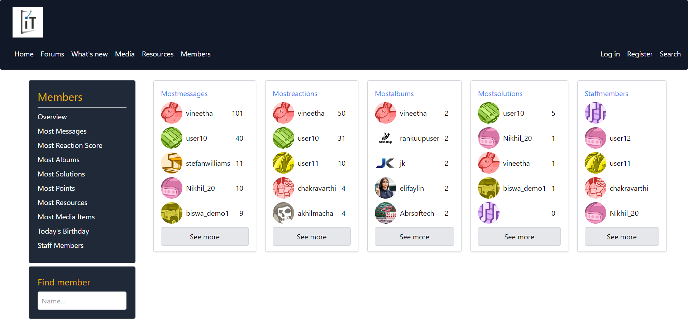
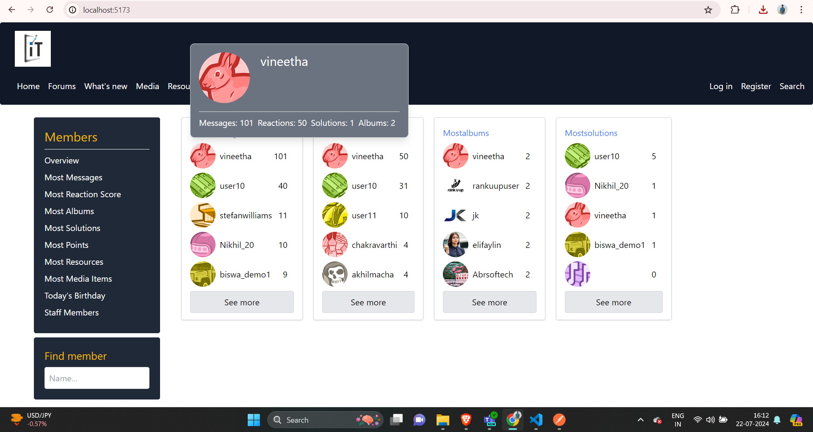
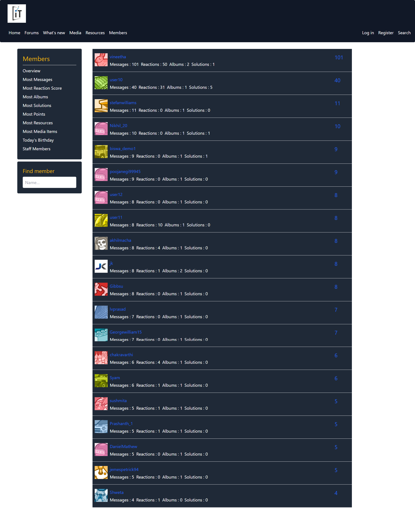

# React + Vite

- **Frontend:**
  - [React](https://reactjs.org/)
  - [Vite](https://vitejs.dev/)

This template provides a minimal setup to get React working in Vite with HMR and some ESLint rules.

Currently, two official plugins are available:

- [@vitejs/plugin-react](https://github.com/vitejs/vite-plugin-react/blob/main/packages/plugin-react/README.md) uses [Babel](https://babeljs.io/) for Fast Refresh
- [@vitejs/plugin-react-swc](https://github.com/vitejs/vite-plugin-react-swc) uses [SWC](https://swc.rs/) for Fast Refresh

# Initial page (reference by https://xenforo.com/community/members/ instead of there apis italent2 demo apis are used ...)

# hover of users ...

# next pages are -- most messages , most reactions , most solutions , most albums , staff members data from high to low ....

# above mentions are buttons/links we can check individually

